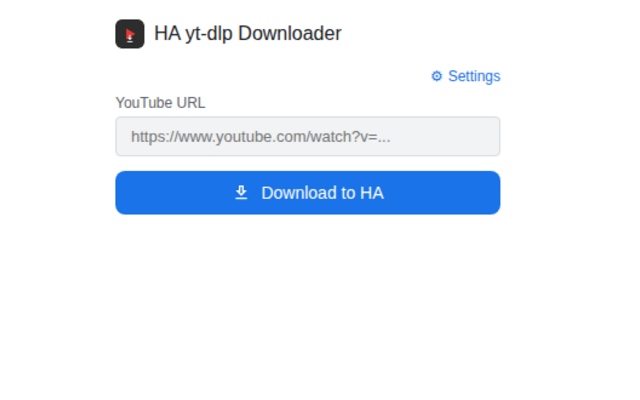

# HA yt-dlp – Chrome Extension

A Manifest V3 Chrome extension that lets you download YouTube videos to your Home Assistant media library with a single click.



## Features

- **Auto-detect YouTube URL** – opens on any `youtube.com/watch` tab and pre-fills the video URL automatically
- **1-click download** – sends a `POST /download_video` request to your HA yt-dlp API
- **Progress and status** – indeterminate progress bar and messages: Queued → Downloading → Saved (or error). You can close the popup; the download continues on the server.
- **Folder and link** – on success, shows the destination folder (e.g. *My media → youtube_downloads*) and an optional **Open Media Browser** link if you set the HA Frontend URL in Settings
- **Clear errors** – failed downloads and invalid input show a short title and a detail line (e.g. server error message or hint to check the API URL)
- **Persistent settings** – yt-dlp API URL and optional HA Frontend URL are stored via `chrome.storage.sync`
- **Material Design 3 UI** – 350×300 px popup with dark/light theme support

## Installation

The extension is distributed via GitHub Releases as a `.zip` file and installed locally using Chrome's Developer Mode. This is the only supported installation method — the extension is not published on the Chrome Web Store.

**Prerequisite:** The ha-yt-dlp backend must be running (either as a Home Assistant add-on or standalone Docker container). You will need its URL for the Configuration step below.

### Step-by-step

1. Go to the [Releases page](https://github.com/tarczyk/ha-yt-dlp/releases) and download the latest `ha-yt-dlp-chrome-ext-<version>.zip`
2. Unzip the file to a permanent local folder (e.g. `~/ha-yt-dlp-chrome-ext/`)
   - Do not delete or move this folder after installation — Chrome loads the extension from it
3. Open Chrome and navigate to `chrome://extensions/`
4. Enable **Developer mode** (toggle in the top-right corner)
5. Click **Load unpacked**
6. Select the unzipped folder

The extension icon will appear in the Chrome toolbar. Pin it for easy access.

### Updating

When a new version is released:

1. Download the new `.zip` from the [Releases page](https://github.com/tarczyk/ha-yt-dlp/releases)
2. Unzip it, replacing the contents of your existing folder (or a new folder)
3. Go to `chrome://extensions/` and click the **reload** icon on the HA yt-dlp Downloader card

### Build from source

To build the zip locally from a checkout:

```bash
# From the repo root
./chrome-ext/build-zip.sh
# Output: chrome-ext/ha-yt-dlp-chrome-ext-<version>.zip
```

Then follow steps 2–6 above using the unzipped contents.

## Permissions

| Permission | Reason |
|---|---|
| `tabs` | Read the URL of the active tab to auto-fill the YouTube URL |
| `activeTab` | Inspect the current tab without requesting all-tabs access |
| `storage` | Persist the HA API URL via `chrome.storage.sync` |
| `host_permissions` (`http://*/*`, `https://*/*`) | The HA API URL is user-configured at runtime and can be any private IP/hostname. Because the target URL is unknown at install time, a broad pattern is required. No requests are ever sent to third-party servers. |

## Configuration

1. Click the extension icon on any page
2. Click **⚙ Settings** to expand the settings panel
3. **yt-dlp API URL** (required) – where the add-on or Docker API runs (e.g. `http://192.168.1.100:5000`)
4. **HA Frontend URL** (optional) – your Home Assistant UI URL (e.g. `http://homeassistant.local:8123`). If set, a link **Open Media Browser** is shown when a download completes
5. URLs are saved automatically when you leave each field (or when you click Download)

## Usage

1. Go to any YouTube video page (`youtube.com/watch?v=…` or `youtu.be/…`)
2. Click the extension icon – the video URL is filled automatically
3. Click **Download to HA**
4. Watch the status: **Queued…** → **Downloading…** (with progress bar) → **Saved: "Video title"** with folder and optional **Open Media Browser** link, or an error message with details

## Distribution

The extension is distributed exclusively via GitHub Releases:

- Each `v*` tag triggers `.github/workflows/release-chrome-ext.yml` which builds the zip and attaches it to the GitHub Release as `ha-yt-dlp-chrome-ext-<version>.zip`
- The Chrome Web Store publish workflow (`publish-chrome-ext.yml`) is disabled — the extension's download functionality is not permitted by Chrome Web Store policy

> No data is sent to third parties. All network requests go directly to the user-configured local API.

## Folder Structure

```
chrome-ext/
├── manifest.json       # Manifest V3 extension descriptor
├── popup.html          # Extension popup UI (350×300 px, Material Design 3)
├── popup.js            # Popup logic (storage, tabs, fetch, polling)
├── background.js       # Service worker (fallback tab opener)
├── icons/
│   ├── icon-16.png
│   ├── icon-48.png
│   └── icon-128.png
├── screenshots/        # Documentation screenshots
└── README-chrome.md    # This file
```

## API Endpoints Used

| Method | Endpoint | Purpose |
|--------|----------|---------|
| `POST` | `/download_video` | Start download; returns `{"task_id": "..."}` |
| `GET`  | `/tasks/<task_id>` | Poll task status (`queued` / `running` / `completed` / `error`) |
| `GET`  | `/config`          | Read `media_subdir` to show the destination folder name |

See the root [`README.md`](../README.md) for full API documentation.
